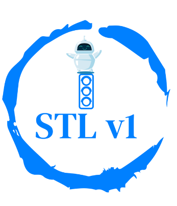
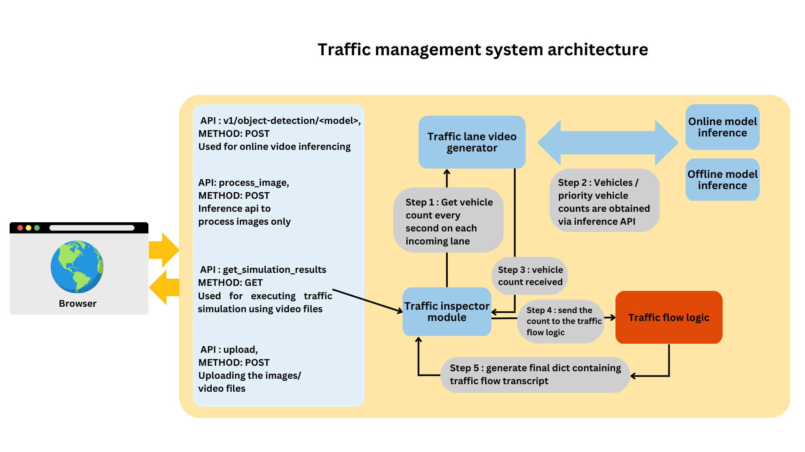

## Traffic management system

  

This is a web application that uses the YOLOv5 and YOLOv8 object detection models to simulate the behavior of traffic lights at an intersection. 
The simulation can be run with or without AI.
 

  

#### Setup
Traffic Inspector Web Application
This is a web application that uses the YOLOv5 and YOLOv8 object detection models to simulate the behavior of traffic lights at an intersection. The simulation can be run with or without AI.

#### Requirements
install the requirements with `pip install -r requirements`

#### Usage
* Clone this repository using  `git clone https://github.com/username/repo.git`
* Install the required libraries using `pip install -r requirements.txt`
* Run the application using `python app.py`.
* Open the URL `http://localhost:5000/` in your web browser.

#### System architecture

  

